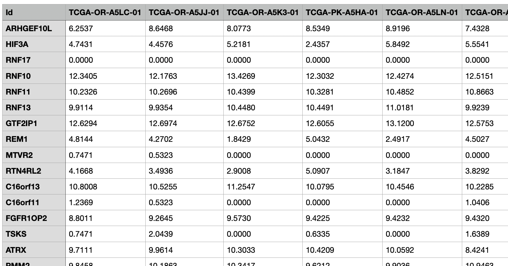
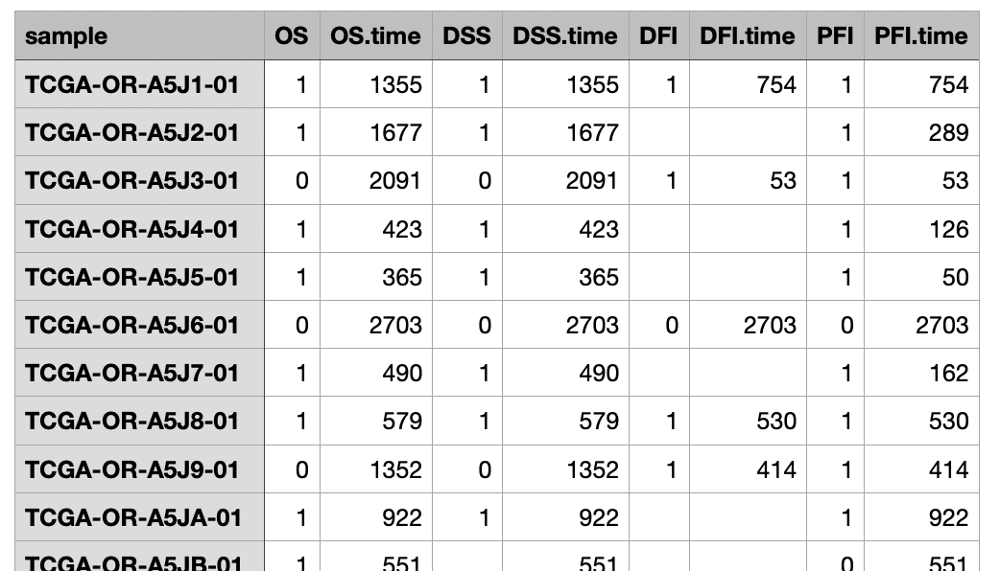
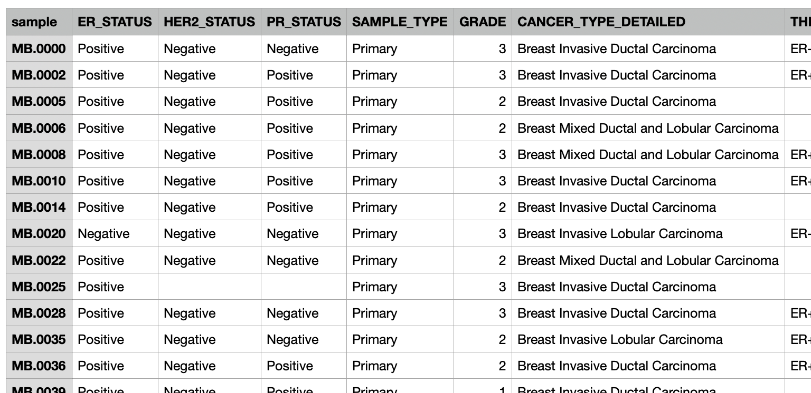

# Clinical data

In this section, users can analyse how their genes of interest impact patient cohorts through various type of exploration methods.

## <u>**Cohort selection and view the data**</u>

A cohort can be selected in the top. Once selected, its details will be shown on the right. The data can be viewed as an excel format in the “View the data” section. For a gene expression, since this table is usually a large data, by default it shows the first 1000 lines to avoid over memory usega. The uses can choose to show all the data if they want.

## <u>**Survival analysis**</u>

This section allows you to examine the association between gene expression and survival outcomes within a selected cohort.

To get started, enter the gene names one per line in the input box, taking care not to include extra spaces before or after each name. The gene names must exactly match those used in your gene expression dataset. Alternatively, you can also choose a geneset from the custom genesets registered in OmicsBridge.

Then choose how to group the samples: either by a median split, dividing them into high and low expression groups, or by comparing the top 25% and bottom 25% of expression levels (quartile split). Next, select the clinical event to use for the analysis, such as Overall Survival (OS) or Progression-Free Survival (PFS).

Once the settings are in place, click the Start button to run the analysis. A results table will be generated, showing the p-value and hazard ratio for each gene (sorted by p-value). Clicking on any gene in the table will display its Kaplan–Meier survival curve on its right.

??? success  "Adjustable graph parameters"

    - The size (width and height) of the figure.
    - The size of the X and Y axis/label font size.
    - The size of the legend title
    - The colour for the high- and low-expression group.

## <u>**Gene correlation**</u>

This section allows you to explore the correlation between gene expression levels within a selected cohort.

Begin by entering the name of the target gene, which will be shown on the Y-axis of the scatter plots.

You can choose between two analysis modes under Explore type:

- <u>Explore one gene's correlation with specific genes</u> (default): After entering the target gene, you manually specify one or more genes to compare with it. These genes will appear on the X-axis. You can input them one per line in the text box (avoiding extra spaces), or select them from a saved Custom Geneset.
- <u>Explore one gene's correlation with all the genes</u>: Only the target gene is needed; the system will automatically calculate correlations between the target gene and all genes available in the selected cohort. Note that this takes a few minutes. 
  
Next, choose the correlation method: Pearson (for linear relationships) or Spearman (for rank-based relationships). Click the Start button to run the analysis.

The output will include a table showing the correlation coefficient and p-value for each gene. Clicking on a gene in the table will display a scatter plot on the right, showing the correlation between that gene and the target gene.

??? success  "Adjustable graph parameters"

    - The size (width and height) of the figure.
    - The size of the X and Y axis/label font size.
    - Change the background from gray to white
    - The colour of the dot
    - Show the correlation line

## <u>**Mutation analysis**</u>

This section allows you to explore and compare the frequency of gene mutations within a selected cohort, provided that mutation data has been uploaded.

To begin, specify the genes you wish to analyse. There are three input options: 1) Enter gene names one per line in the text box (avoiding extra spaces), 2) Choose to analyse all genes in the dataset, or 3) Select genes from a saved Custom Geneset.

By default, the analysis includes all samples in the cohort. However, you may filter the samples based on metadata categories (e.g. treatment group, subtype, or gender) to compare mutation frequencies across different groups.

After clicking the Start button, a table will be generated showing the number of samples with mutations in each gene, and the corresponding mutation frequency. In addition, a bar plot will be displayed, visualising either the top genes by count or by frequency of mutation, depending on the results.

??? success  "Adjustable graph parameters"
    - Can choose to show either the number of samples with mutations or the mutation frequency
    - Can choose to show a score on top of each bar
    - The number of genes to show in the bar plot
    - The size (width and height) of the figure.
    - The size of the X and Y axis/label font size.
    - The size of the legend font and the score font
    - Use a white background
    - The colour of the bar plot

## <u>**Gene expression across subtypes**</u>

When metadata for the cohort is provided and patients can be divided into subtypes, users can compare gene expression across these groups.

Enter your genes of interest and select a category for subtyping from the "Group by" menu. Click "Start comparing" to analyse gene expression across subtypes using statistical tests. For two subtypes, the tool uses the Wilcox test; for three or more subtypes, it uses the Kruskal-Wallis test. The results table shows statistical scores (W values for two subtypes, H values for three or more) and p-values, sorted by p-value. Therefore, genes at the top of the table show the largest expression differences between subtypes. Click any row to display a visualization on the right. You can choose between Box plot, Violin plot, Swarm plot, or Violin + Swarm plot formats.

??? success  "Adjustable graph parameters"
    - the size (width and height) of the figure.
    - the size of the X and Y axis/label font size.
    - the size of the graph title.
    - the colour for the high- and low-expression group.

## <u>**Signature analysis**</u>

## <u>**Deconvolution analysis**</u>

## <u>**Compare cohorts**</u>

## <u>**Cancer Gene Census (COSMOS)**</u>

## <u>**Manage the cohort database**</u>
Select a cohort dataset to view its details on the right. Three tables will be displayed in the "View the data" section: Gene expression, Patient survival information, and Metadata. You can also upload your own cohort from the "upload own cohort" sub-section.
 
### <u>**Pre-installed cohort**</u>
[TCGA](https://www.nature.com/articles/ng.2764) data (34 cancer types, see the table below) is available as pre-installed cohorts. This includes mRNA sequencing results, clinical information, metadata and mutation data downloaded from [UCSC](https://xenabrowser.net/datapages/?hub=https://tcga.xenahubs.net:443) Xena, with gene expression values transformed as log2(RSEM normalised count+1).

??? info  "TCGA abbreviation"
    | Abbreviation | Cancer type |
    | --- | --- |
    | TCGA_ACC | Adrenocortical carcinoma |
    | TCGA_BLCA | Bladder Urothelial Carcinoma |
    | TCGA_BRCA | Breast invasive carcinoma |
    | TCGA_CESC | Cervical squamous cell carcinoma and endocervical adenocarcinoma |
    | TCGA_CHOL | Cholangiocarcinoma |
    | TCGA_COAD | Colon adenocarcinoma |
    | TCGA_DLBC | Lymphoid Neoplasm Diffuse Large B-cell Lymphoma |
    | TCGA_ESCA | Esophageal carcinoma |
    | TCGA_GBM | Glioblastoma multiforme |
    | TCGA_HNSC | Head and Neck squamous cell carcinoma |
    | TCGA_KICH | Kidney Chromophobe |
    | TCGA_KIRC | Kidney renal clear cell carcinoma |
    | TCGA_KIRP | Kidney renal papillary cell carcinoma |
    | TCGA_LAML | Acute Myeloid Leukemia |
    | TCGA_LGG | Brain Lower Grade Glioma |
    | TCGA_LIHC | Liver hepatocellular carcinoma |
    | TCGA_LUAD | Lung adenocarcinoma |
    | TCGA_LUSC | Lung squamous cell carcinoma |
    | TCGA_MESO | Mesothelioma |
    | TCGA_PAAD | Pancreatic adenocarcinoma |
    | TCGA_PCPG | Pheochromocytoma and Paraganglioma |
    | TCGA_PRAD | Prostate adenocarcinoma |
    | TCGA_READ | Rectum adenocarcinoma |
    | TCGA_SARC | Sarcoma |
    | TCGA_SKCM | Skin Cutaneous Melanoma |
    | TCGA_TGCT | Testicular Germ Cell Tumors |
    | TCGA_THCA | Thyroid carcinoma |
    | TCGA_THYM | Thymoma |
    | TCGA_UCEC | Uterine Corpus Endometrial Carcinoma |
    | TCGA_UCS | Uterine Carcinosarcoma |
    | TCGA_UVM | Uveal Melanoma |
    | TCGA_COADREAD | Colon and Rectal Cancer |
    | TCGA_GBMLGG | lower grade glioma and glioblastoma |
    | TCGA_LUNG | Lung Cancer |   

### <u>**How to upload an own cohort**</u>

The users can upload their own cohort and analyse it here. Three files (Gene expression, Clinical data a d Metadata) should be uploaded. Optionally, mutation data can be added. Each data has to follow the following data format.

#### 1. **Gene expression**

A tab-delimited table of the gene expression of each sample (genes × samples(patients)) from bulk RNAseq (or microarray). 

- Ensure the data is already normalised before uploading, as the interface does not perform normalisation automatically.
- Rows (index): gene names.
- Columns (headers): sample names that match those used in your clinical data.

??? tip "Example"
    

#### 2. **Patient survival information**

A tab-delimited table containing the information of overall survival, progression-free survival, etc (those needed for generating a Kaplan-Meier curve or survival analysis). Please follow these rules.

- The first column must contain sample IDs and should have the header named `sample` (in all lowercase). All sample IDs should exactly match those used in your gene expression and clinical data.
- All other columns must represent pairs of event data:
   One column for the event status (censoring), with binary values: 1 (event occurred) or 0 (censored).
   One corresponding column for the event time (in days), labelled with the same event name followed by .time.
- For example: For Overall Survival (OS), use one column named OS for event status and use another column named OS.time for the number of days until the event or censoring. Similary, for other types of events (e.g., DSS, DFI, PFI), follow the same format. DSS and DSS.time, DFI and DFI.time, PFI and PFI.time, etc.
- You may include other columns in the dataset that do not follow the event/time pair format. These columns will be safely ignored and will not affect the analysis.

??? tip "Example"
    

#### 3. **Metadata**

Please upload a tab-delimited (.tsv) table containing metadata for the samples (patients) in your cohort. This may include information such as treatment condition, gender, grade, or cancer subtype.

- The first column must contain the sample IDs, and the header for this column must be `sample` (all lowercase). All sample IDs should exactly match those used in your gene expression and clinical data.

If you do not have any metadata to include, please upload a .tsv file that contains only the sample IDs in the first column with the header `sample`. This ensures consistency and allows the interface to process the data correctly.

??? tip "Example"
    

#### 4. Mutation data

### <u>**Edit or delete the cohort**</u>
