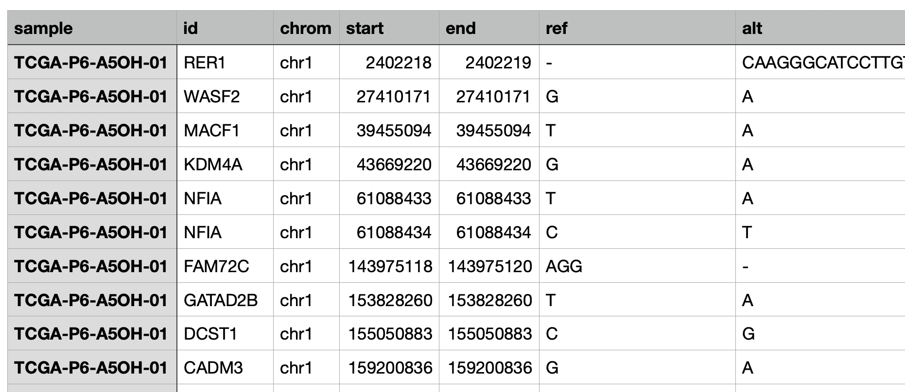

# **Clinical data**

---

## <u>**1. Cohort selection and view the data**</u>

A cohort can be selected in the top. Once selected, its details will be shown on the right.

Click "Reload your clinical datasets list" to refresh with any cohorts uploaded or edited since the page was loaded.

The data can be viewed as an interactive, sortable/searchable table in the "View the data" section, split across four tabs:

- **Gene expression**: Since this table is usually large, by default it shows only the first 1000 rows to avoid overloading the server's memory. Switch to "Show everything" if you need the full table (may be slow for large datasets).
- **Survival**: The patient survival/event data table (see Section 10.2.2 below for its format).
- **Meta data**: The patient metadata table. You can also edit it directly here — toggle "Add a new metadata column" to create a new column and fill in its values, or "Delete a metadata column" to remove one.
- **Mutation data**: The mutation data table, if one was uploaded for this cohort.

---

## <u>**2. Survival analysis**</u>

This section examines the association between gene expression and survival outcomes within a selected patient cohort.

1. Enter individual gene names line by line or select a custom gene set.
2. Choose how to divide patients into high- and low-expression groups:
    - Using the median (default)
    - Using top 25% vs. bottom 25%
    - Using custom-defined thresholds (e.g., top X% vs. bottom Y%)
    - Manually specifying the two groups by entering sample names directly
3. Choose sample filtering: "Use all samples" (default), or "Use the selected samples by a specific category" to restrict the analysis to patients matching one metadata category (e.g. a specific treatment group or subtype) before splitting them into groups.
4. Select the event type
5. Click "Start the survival analysis".
    - It generates a results table showing p-values and hazard ratios for each gene, sorted by the hazard ratio. The table is downloadable via "Download this table".
6. Click on any row in the results table to display the corresponding Kaplan–Meier curve.
7. Use the histogram feature to visualise gene expression distributions, which can help determine appropriate sample splitting criteria.

The survival events available for analysis (such as overall survival or progression-free survival) depend on the metadata included in your cohort dataset. For more details, please refer to **10.2. How to upload your own cohort** section.

??? success  "Adjustable graph parameters (Kaplan-Meier curve)"

    - The size (width and height) of the figure.
    - The size of the X and Y axis/label font size.
    - The size of the legend title
    - The colour for the high- and low-expression group.

??? success  "Adjustable graph parameters (Expression distribution histogram)"

    - The size (width and height) of the figure.
    - X and Y axis/label font size, and graph title size.
    - The colour of the histogram bars.
    - Number of histogram bins (10-100, default: 20).
    - Option to switch from grey to white background.

??? example  "Example Usage video"
    <video width="1000" controls>
    <source src="../videos/Clinical_1_annot_light.mp4" type="video/mp4"> 
    </video>

---

## <u>**3. Gene correlation**</u>

This section computes and visualises pairwise correlations between the expression levels of multiple genes, across the patients in the selected cohort.

Enter two or more genes to get a correlation heatmap across all of them, then drill down into any specific pair to see its own scatter plot.

1. Enter the genes to correlate, either by typing gene names line by line, or by toggling "Use the genes from the custom gene sets" to pull genes from one of your registered custom gene sets instead.
2. Choose sample filtering: "Use all samples" (default), or "Use the selected samples by a specific category" to restrict the analysis to patients matching one metadata category.
3. Choose the calculation method: Pearson or Spearman.
4. Click "Calculate the correlation" to compute the full pairwise correlation matrix across all your input genes.
5. View the results:
    - **Correlation table**: Select one of your input genes from the "Select a gene to show its correlation result table" drop-down to see a table of that gene's correlation (r-value and p-value) against every other gene you entered. The table is downloadable via "Download this table".
    - **Pairwise heatmap**: By default, the "Plot" panel shows a clustered heatmap of the full pairwise correlation matrix across all your input genes — genes are automatically reordered by hierarchical clustering so similarly-correlated genes sit together.
    - **Scatter plot for one pair**: Once you've selected a gene from the drop-down above, click its row in the correlation table to pick a second gene — the "Plot" panel then switches to a scatter plot of just that gene pair, with an optional regression line.

??? success  "Adjustable graph parameters (Pairwise heatmap)"

    - Figure width and height
    - X/Y axis label size (set to 0 to hide the gene name labels entirely)
    - Legend font size
    - Colour for the lowest correlation (-1), highest correlation (+1), and mid correlation (0)

??? success  "Adjustable graph parameters (Scatter plot)"

    - Figure width and height
    - X/Y axis label size and title size
    - Colour of the dots
    - Option to show the correlation line (on by default)
    - Option to use a white background

??? example  "Example Usage video"
    <video width="1000" controls>
    <source src="../videos/Clinical_2_annot_light.mp4" type="video/mp4"> 
    </video>

---

## <u>**4. Mutation analysis**</u>

This section helps you analyse gene mutations in the selected cohort.

1. Input the genes to investigate by:
    - Entering gene names one per line in the text box ('Text input')
    - Choosing to analyse all genes in the dataset ('Use all genes')
    - Selecting a gene set from a custom gene set ('Select from custom genesets')
2. Filter the samples if necessary
    - By default, all cohort samples are included ('Use all samples')
    - When choosing 'Use the selected samples by a specific category', you can filter samples using metadata (treatment group, cancer subtype, demographics) for targeted analysis
3. Click "Calculate the mutation frequency". A Results table will appear in the bottom left section. The following plots will be generated in the tabs:
    - **Frequency Plot** tab: 
    A bar plot showing the frequency or the counts of mutated genes. The Y-axis displays either mutation count or frequency (%). You can adjust the number of genes to display.
    - **Survival analysis** tab: 
    Select an event for survival analysis. Clicking a gene name displays a Kaplan-Meier curve comparing the wild-type patients and the mutant patients.
    - **Gene expression plot** tab: 
    This comparison examines the expression levels between the wild-type and mutant groups. Choose a plot type — Box plot, Violin plot, Swarm plot, or Violin + Swarm plot.
        1. Click a gene in the mutation analysis results table
        2. Enter genes in the input field to generate a table listing these genes
        3. Click a gene from the Input genes table to generate a plot comparing its expression between the wild-type and mutant patients

??? success  "Adjustable graph parameters"
    1. Frequency Plot
        - Plot size (width and height)
        - X and Y label size
        - Legend size
        - Score font size (the value labels drawn on each bar)
        - Colour for the highest value, and for zero
        - Number of genes to display
        - White background option
        - Option to hide scores on each bar
    2. Survival analysis
        - Figure size (width and height)
        - X and Y axis/label font size
        - Legend title size
        - Colours for high and low expression groups
    3. Gene expression plot
        - Plot size (width and height)
        - X and Y label size
        - Dot size (for the swarm plot)
        - Graph title and legend font size
        - Colours for wild-type and mutant groups
        - White background option

??? example  "Example Usage video"
    <video width="1000" controls>
    <source src="../videos/Clinical_3_annot_light.mp4" type="video/mp4"> 
    </video>

---

## <u>**5. Gene expression across subtypes**</u>

When metadata for the cohort is provided and patients can be divided into subtypes, users can compare gene expression across patient subgroups.

1. Enter the genes or select a custom gene set
2. Select a category for subtype from the "Group by" drop-down menu. If the category has more than two subtypes, you can toggle "Want to compare only two subtypes?" to restrict the comparison to exactly two of them.
3. Click "Start comparing" to compare gene expression across subtypes. Note that visualisation may be slow and cluttered when there are many subtypes in the selected group.
4. A result table with statistical scores and p-values will be generated (downloadable via "Download this table"). Statistical scores include W values for two subtypes and H values for three or more subtypes.
5. Clicking any row in the table displays a visualisation on the right. Available plot types include Box plot, Violin plot, Swarm plot, or Violin + Swarm plot

??? success  "Adjustable graph parameters"
    - Figure size (width and height)
    - X and Y axis/label font size
    - Graph title size
    - Dot size (for the swarm plot)
    - Colour palette for each subtype, or "Use a single colour" to override it with one flat colour
    - Option to rotate the X-axis labels
    - Option to switch from grey to white background

??? example  "Example Usage video"
    <video width="1000" controls>
    <source src="../videos/Clinical_4_annot_light.mp4" type="video/mp4"> 
    </video>

---

## <u>**6. Signature analysis**</u>

This section performs signature analysis on gene expression data from the selected cohort to evaluate the activity or presence of specific biological processes.

1. Choose the input type by either:
    - Selecting from custom gene sets
    - Entering gene names line by line
2. Choose sample filtering: "Use all samples" (default), or "Use the selected samples by a specific category" to restrict the analysis to patients matching one metadata category.
3. Select the calculation method:
    - GSVA (Gene Set Variation Analysis) or ssGSEA (single-sample Gene Set Enrichment Analysis) is available.
           
4. Click "Calculate the signature score". This generates a result table with scores for each sample, downloadable via "Download this table".
5. Three plots are generated:
    - **Survival analysis plot** tab:
        - Generates a Kaplan-Meier plot.
        - Allows selection of methods to split samples into high and low-score patients: by median, Top 25% vs Bottom 25%, or a custom Top X% vs Bottom Y%.
    - **Score comparison** tab:
        - Select the group to compare signature scores. If the group has more than two subtypes, you can toggle "Want to compare only two subtypes?" to restrict the comparison to exactly two of them.
        - Click "Show a plot". Four plot types are available (Box plot, Violin plot, Swarm plot, and Violin + Swarm plot).
    - **Distribution** tab:
        - Generates a histogram of signature scores to help determine appropriate sample splitting criteria.
  
??? info "What is GSVA and ssGSEA?"
    GSVA (Gene Set Variation Analysis) calculates an enrichment score for each gene set by transforming gene expression data into a pathway activity score across samples. It uses kernel-based density estimation to assess the relative enrichment of a gene set, comparing it to the overall expression distribution in the dataset.
    
    ssGSEA (single-sample Gene Set Enrichment Analysis), on the other hand, ranks genes within each sample and calculates an enrichment score based on the ranked positions of genes in a gene set. It evaluates how consistently genes of a set are positioned at the top or bottom of the ranked gene list for each individual sample.

??? success  "Adjustable graph parameters"
    - **Survival analysis plot**
        - Figure size (width and height)
        - X and Y axis/label font size
        - Legend title size
        - Colors for high and low expression groups
    - **Score comparison plot**
        - Figure size (width and height)
        - X and Y axis/label font size and graph title font size
        - Dot size (for the swarm plot)
        - Color palette, or "Use a single colour" to override it with one flat colour
        - Option to rotate the X-axis labels
        - Option to switch from grey to white background
    - **Histogram**
        - Figure size (width and height)
        - X and Y axis/label font size
        - Histogram bin color
        - Number of histogram bins
        - Option to switch from grey to white background

??? example  "Example Usage video"
    <video width="1000" controls>
    <source src="../videos/Clinical_5_annot.mp4" type="video/mp4"> 
    </video>

---

## <u>**7. Deconvolution analysis**</u>

This section provides deconvolution analysis from patients' gene expression data (typically bulk RNAseq). While several deconvolution tools exist, two are available here: [MCPcounter](https://github.com/ebecht/MCPcounter) and [xCell](https://comphealth.ucsf.edu/app/xcell).

1. Select the cohort
2. Choose either MCPcounter or xCell as your method, then click "Start deconvolution". A deconvolution result table will appear on the right, downloadable via "Download this table".

The interface provides two additional analysis tabs. 

??? example  "Example Usage video"
    <video width="1000" controls>
    <source src="../videos/Clinical_6_annot.mp4" type="video/mp4"> 
    </video>

### <u>**7.1. Generating a heatmap/barplot**</u>
First, you can generate a heatmap or barplot to visualise cell type fractions across samples.

1. Choose which samples to use:
    - "All samples": Includes every sample in the dataset
    - "Filter from metadata":
        - Filter samples by subtypes using information from the metadata files
        - The number of samples selected will be displayed after choosing a category
    - "Text input": Enter sample IDs (patient IDs) line by line in the text box, ensuring no extra spaces
2. Choose which cell types to include:
    - "All cell types": Includes all available cell types
    - "Select cell types":
        - A table of available cell types will be displayed
        - Click on specific cell types you want to include in the plot
3. Click "Show a heatmap" to generate a heatmap and barplot on the right

??? success  "Adjustable graph parameters (Heatmap)"
    - Figure size (width and height)
    - X and Y axis font size
    - Legend font size
    - Colour for the highest value, and for zero

??? success  "Adjustable graph parameters (Barplot)"
    - Figure size (width and height)
    - X and Y axis font size
    - Legend font size
    - "Percentile plot" option: switch from raw scores to percentile-scaled values

### <u>**7.2. Exploring correlations between gene expression and cell type abundance**</u>

This feature allows you to analyse the relationship between specific gene expression levels and cell type abundance.

1. Enter the gene names line by line (or choose a gene set)
2. Select a cell type to investigate
3. Choose sample filtering: "Use all samples" (default), or "Use the selected samples by a specific category" to restrict the analysis to patients matching one metadata category.
4. Choose a correlation method, either Pearson or Spearman
5. Click "Calculate the correlation". This calculates the correlation between gene expression and cell type abundance, generating a table with correlation coefficients and p-values, downloadable via "Download this table".
6. Clicking any row in the result table generates a scatter plot.

??? success  "Adjustable graph parameters"
    - Figure size (width and height)
    - X and Y axis font size
    - Legend font size
    - Dot and correlation line colours
    - Option to display or hide the correlation line
    - Option to use a white background

---

## <u>**8. Compare cohorts**</u>
In this section, you can compare gene expression or mutation frequency across different cohorts.

1. (You do not have to select a cohort in this section)
2. Enter gene names line by line, or choose a custom gene set
3. The list of genes will appear. Click the gene you want to investigate.
4. Select the cohorts you want to include.
    - All cohorts stored in OmicsBridge will be listed.
    - You can select multiple cohorts, but note that generating figures may take longer, especially for gene expression analysis. (ex. When selecting all TCGA cohorts, it takes ~30 sec for the mutation frequency analysis and ~2 minutes for the gene expression analysis.)
5. Click "Compare mutation frequencies" or "Compare gene expressions", depending on the tab you're in ("Mutation Frequency" or "Gene expression")
    - In "Mutation Frequency," a bar plot will display the number or percentage of patients with mutations in the selected gene across the chosen cohorts — choose which via the "Y axis" option.
    - In "Gene expression," a box plot is generated that compares gene expression levels across the selected cohorts

??? success  "Adjustable graph parameters (Mutation Frequency)"
    - Figure size (width and height)
    - Font size for x-axis, y-axis, legend, and the score labels on each bar
    - Colour for the highest value, and for zero
    - Option to use a white background
    - Option to hide the score labels on each bar

??? success  "Adjustable graph parameters (Gene expression)"
    - Figure size (width and height)
    - Font size for x-axis and y-axis
    - Option to use a white background

??? example  "Example Usage video"
    <video width="1000" controls>
    <source src="../videos/Clinical_9_annot_light.mp4" type="video/mp4"> 
    </video>

---

## <u>**9. Cancer Gene Census (COSMIC)**</u>
OmicsBridge includes a database of cancer predisposition genes sourced from [Cancer Gene Census from COSMIC](https://cancer.sanger.ac.uk/census). This feature helps you identify which genes from your input are known to be associated with cancer predisposition.

1. Enter gene names line by line, or toggle "Use the genes from the custom gene sets" to pull genes from one of your registered custom gene sets instead.
2. If any of the genes you entered are associated with cancer predisposition, they will appear in the results table. If none match, the complete database will be displayed instead. The table is downloadable via "Download this table".

??? example  "Example Usage video"
    <video width="1000" controls>
    <source src="../videos/Clinical_10_annot_light.mp4" type="video/mp4"> 
    </video>

---

## <u>**10. Manage the cohort database**</u>
The users can manage the cohort database and upload or delete datasets in the “Cohort database” tab.

### <u>**10.1. Pre-installed cohort**</u>
[TCGA](https://www.nature.com/articles/ng.2764) data (34 cancer types, see the table below) is available as pre-installed cohorts. This includes mRNA sequencing results, clinical information, metadata and mutation data downloaded from [UCSC](https://xenabrowser.net/datapages/?hub=https://tcga.xenahubs.net:443) Xena, with gene expression values transformed as log2(RSEM normalised count+1).

??? info  "TCGA abbreviation"
    | Abbreviation | Cancer type |
    | --- | --- |
    | TCGA_ACC | Adrenocortical carcinoma |
    | TCGA_BLCA | Bladder Urothelial Carcinoma |
    | TCGA_BRCA | Breast invasive carcinoma |
    | TCGA_CESC | Cervical squamous cell carcinoma and endocervical adenocarcinoma |
    | TCGA_CHOL | Cholangiocarcinoma |
    | TCGA_COAD | Colon adenocarcinoma |
    | TCGA_DLBC | Lymphoid Neoplasm Diffuse Large B-cell Lymphoma |
    | TCGA_ESCA | Esophageal carcinoma |
    | TCGA_GBM | Glioblastoma multiforme |
    | TCGA_HNSC | Head and Neck squamous cell carcinoma |
    | TCGA_KICH | Kidney Chromophobe |
    | TCGA_KIRC | Kidney renal clear cell carcinoma |
    | TCGA_KIRP | Kidney renal papillary cell carcinoma |
    | TCGA_LAML | Acute Myeloid Leukemia |
    | TCGA_LGG | Brain Lower Grade Glioma |
    | TCGA_LIHC | Liver hepatocellular carcinoma |
    | TCGA_LUAD | Lung adenocarcinoma |
    | TCGA_LUSC | Lung squamous cell carcinoma |
    | TCGA_MESO | Mesothelioma |
    | TCGA_PAAD | Pancreatic adenocarcinoma |
    | TCGA_PCPG | Pheochromocytoma and Paraganglioma |
    | TCGA_PRAD | Prostate adenocarcinoma |
    | TCGA_READ | Rectum adenocarcinoma |
    | TCGA_SARC | Sarcoma |
    | TCGA_SKCM | Skin Cutaneous Melanoma |
    | TCGA_TGCT | Testicular Germ Cell Tumors |
    | TCGA_THCA | Thyroid carcinoma |
    | TCGA_THYM | Thymoma |
    | TCGA_UCEC | Uterine Corpus Endometrial Carcinoma |
    | TCGA_UCS | Uterine Carcinosarcoma |
    | TCGA_UVM | Uveal Melanoma |
    | TCGA_COADREAD | Colon and Rectal Cancer |
    | TCGA_GBMLGG | lower grade glioma and glioblastoma |
    | TCGA_LUNG | Lung Cancer |   

### <u>**10.2. How to upload your own cohort**</u>

The users can upload their own cohort and analyse it here. Three files (Gene expression, Patient survival information, and Metadata) should be uploaded. Optionally, mutation data can be added. Each data has to follow the following data format.

#### <u>**10.2.1 Gene expression**</u>

A tab-delimited table of the gene expression of each sample (genes × samples(patients)) from bulk RNAseq (or microarray). 

- Ensure the data is already normalised before uploading, as the interface does not perform normalisation automatically.
- Rows (index): gene names.
- Columns (headers): sample names that match those used in your clinical data and metadata.

??? tip "Example"
    

####  <u>**10.2.2. Patient survival information**</u>

A tab-delimited table containing the information of overall survival, progression-free survival, etc (those needed for generating a Kaplan-Meier curve or survival analysis). Please follow these rules.

- **The first column must contain sample IDs and should have the header named `sample` (in all lowercase).** All sample IDs should exactly match those used in your gene expression and clinical data.
- **All other columns must represent pairs of event data**: 
   One column for the event status (censoring), with binary values: 1 (event occurred) or 0 (censored).
   One corresponding column for the event time (in days), labelled with the same event name followed by `.time`.   
   For Example, when you have Overall Survival (OS) data, use one column named `OS` for event status and use another column named `OS.time` for the number of days until the event or censoring. Similary, for other types of events (e.g., DSS, DFI, PFI), follow the same format. `DSS` and `DSS.time`, `DFI` and `DFI.time`, `PFI` and `PFI.time`, etc.

- You may include other columns in the dataset that do not follow the event/time pair format. These columns will be safely ignored and will not affect the analysis.

??? tip "Example"
    

####  <u>**10.2.3. Metadata**</u>

Please upload a tab-delimited (.tsv) table containing metadata for the samples (patients) in your cohort. This may include information such as treatment condition, gender, grade, or cancer subtype.

- The first column must contain the sample IDs, and the header for this column must be `sample` (all lowercase). All sample IDs should exactly match those used in your gene expression and clinical data.

If you do not have any metadata to include, please upload a .tsv file that contains only the sample IDs in the first column with the header `sample`. This ensures consistency and allows the interface to process the data correctly.

??? tip "Example"
    

#### <u>**10.2.4. Mutation data**</u>
If you have information about which genes are mutated in which patients, you can upload this as a TSV file.
    
- Similar to the patient survival information and metadata, the first column must contain the sample IDs, with the header `sample` (all lowercase).
- The second column contains gene names, with the header `id`.

These two columns are sufficient. Any additional columns will be ignored.

??? tip "Example"
    

#### <u>**10.2.5. How to upload**</u>

Once your files are ready in the formats described above, uploading a new cohort works as follows, in the "Upload" box below the "Registered cohort" table:

1. Upload your Gene expression and Patient survival information files (both required) in the two upload widgets provided.
2. Upload your Metadata file (required) and, if you have one, your Mutation data file (optional) in the two upload widgets below that.
3. Enter a "Cohort Name" (required, must be unique across all cohorts) and an optional "Description".
4. Check the "Previews" tabs (Expression table, Survival data, Meta data, Mutation data) to confirm each file was read correctly before submitting.
5. Click "Add a new cohort" to register the cohort.

If you want to start over, click "Reset uploaded files" to clear everything you've uploaded so far.

??? warning "Formatting reminders"
    - The column containing sample (patient) IDs must be named "sample", and the column containing gene names must be named "id".
    - The Cohort Name is mandatory and must be unique.
    - Avoid special characters in the Cohort Name; use only letters, numbers, underscores, and dots.

### <u>**10.3. Edit or delete the cohort**</u>

Click "Reload the database" (above the "Registered cohort" table) at any time to refresh the table with the latest data from the underlying database file.

#### <u> **10.3.1. Editing**</u>

1. Go to the "Registered cohort" table in the Cohort database section.
2. Edit the table by double-clicking on the desired field.
3. After making your changes, click the "Save changes" button. When you see the message "saved!", your edits have been successfully applied.

#### <u> **10.3.2. Delete**</u>

1. Go to the "Registered cohort" table in the Cohort database section.
2. Select the row(s) you wish to delete.
3. Click the "Delete selected data" button.