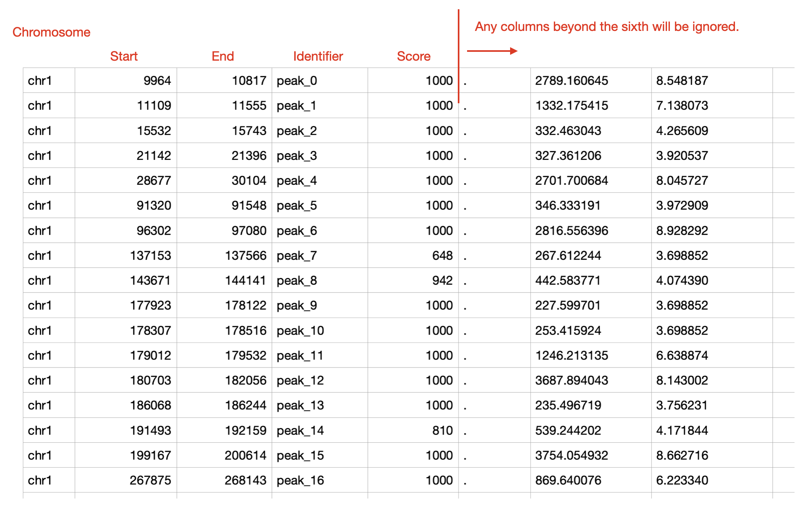

# **Database and Data Upload** 

This section allows users to browse all datasets registered within the interface (i.e., custom database). Additionally, users can upload new datasets and modify information regarding existing datasets.

---

## <u> **1. Available data types** </u>

The interface accommodates four distinct types of data and specifies the required formatting for each.

===  "**A. Count Data / Expression Matrix Data**"
    The read count tables derived from RNA sequencing, proteomics, and various other sources, whether normalised or non-normalised, are considered. Non-normalised (raw count) data is also accepted. 
    
    For RNA-seq count data specifically, the Data Overview module's Data Table tab offers on-the-fly normalisation to CPM, TPM, or FPKM without leaving the interface — TPM and FPKM require matching each gene to a reference gene length (currently based on human gene symbols), while CPM does not. 
    
    These normalisation options are designed for RNA-seq data; for count data from other omics layers (e.g., proteomics, CRISPR screening), the interface does not offer normalisation, so pre-normalised data is recommended. 
    
    Ensure that the data adheres to the following criteria:

    - The table must be in tab-delimited or comma-delimited format (.tsv, .txt, or .csv file), featuring gene names in the index and sample names in the columns.
    - The header name (column name) containing gene names should be designated as "id" .
    - The samples must be named using the format $(Group.Name)_RepX or ${Group.Name}_repX, such as THP1_STK11KO_Rep1, THP1_STK11KO_Rep2, THP1_WT_Rep1, etc.

    ??? tip "Example"
        

===  "**B. Comparison Data**"
    Any dataset containing log fold changes and statistical scores, including differentially expressed gene results from RNA sequencing and outcomes of CRISPR screening, among others, suitable for generating a volcano plot, may be input into OmicsBridge. 
    
    It is imperative that the data complies with the following criteria:

    - The table must be formatted as tab-delimited or comma-delimited (.tsv, .txt, or .csv file) and must include headers, featuring gene names in the index.
    - The header name (column name) that encompasses gene names should be designated as "id".

    ??? tip "Example"
        

=== "**C. scRNAseq data**"
    scRNA data properly processed by Seurat and saved as an RDS file can be input to the interface. The scRNA data must be processed using Seurat and ready for UMAP plotting (not tSNE). 
    
    Before uploading to the interface, it is highly recommended to annotate each cluster with its corresponding cell type.

    ??? note "Seurat object preprocess"
        The Seurat object must be loaded from an RDS file. Ensure that `Reductions(Seurat_object)` returns "umap". While the metadata (Seurat_object@meta.data) is flexible, your data should ideally include "seurat_clusters" and "Annotation" fields for optimal functionality.
        

=== "**D. Epigenome data (bed, bigwig and bam file)**"
    Bed, bigwig and bam files from ATACseq, ChIPseq, and similar analyses can be viewed in the "Epigenome Visualisation" section.  

    > Note: In the upload form's "Data Class" dropdown, this data type is further split into three separate options — **D: bed/narrowPeak**, **E: bigwig**, and **F: bam (+ bai)** — since each requires a different file input.

    - Bed files must not contain headers and must be tab-delimited. They should include at least five columns: chromosome name, start and end positions, feature name/identifier, and score (ranging from 0 to 1000). Any columns beyond the sixth will be ignored. Please refer to the example bed file below.
    - For bam files, you must also provide the corresponding index file (bai file). When you select bam as a Data Class, an upload option will appear. If the bai file doesn't match the bam file, you'll receive an error message. 

    ??? tip "Example(bed file)"
        

---

## <u> **2. How to upload a new dataset** </u>

Users can upload new datasets in the 'Data upload' section by following these steps.

### **2.1. Upload a file**. 
A file can be selected or dragged and dropped into the file upload section. Make sure the file format and data format meet the requirements described above. 

The maximum data size configured for upload is 10 GB, but in practice the largest file you can upload successfully depends on your own computer's available memory, disk space, and network connection — very large files (e.g. BAM) may fail well below that limit on lower-resource systems.

### **2.2. Complete the dataset information**.
Do not use line breaks in any text boxes, as the database will only keep the first line. Fields marked with an asterisk (*) are required. Also, avoid using special characters (such as /,!,?, etc.).

| **Field**  | **Description**|
|-----|-----|
| **Dataset Name***      | Denotes the name assigned to the dataset to be uploaded. Duplicate dataset names are prohibited.  |
| **Experiment Name***   | Refers to the name of the experiment to which the dataset is associated. This information aids in filtering the dataset for selection in the Database or Count & Comparison Data Overview section. |
| **Data from***       | Indicates the origin or creator of the dataset (e.g., "Public data", "Student A").  |
| **Data Type***         | Represents the category of data, such as “DEG from RNAseq” or “CRISPR screening.” All datasets under the same Data Type must have identical data structures (same header/column names) for comparison. |
| **Data Class***        | Select the appropriate classification for the dataset.|
| **Control group name** (Optional, Data Class B only) | The name of the control/reference group used in the comparison (e.g., "Untreated", "WT"). Only shown when Data Class = B (Comparison data). |
| **Treatment group name** (Optional, Data Class B only) | The name of the treatment/experimental group used in the comparison (e.g., "Treated", "KO"). Only shown when Data Class = B (Comparison data). |
| **Cell Line** (Optional)     | Specifies the cell line utilised in the experiment (e.g., MCF7, THP1, Mouse Monocyte Derived Macrophages, etc.).|
| **Collection Date** (Optional) | Denotes the time period during which the dataset was collected.|
| **Description** (Optional)    | Provides additional details regarding the dataset.|

### **2.3. Click on ‘Add to the dataset’**.
If the upload is successful, a message stating “Uploaded!” will appear adjacent to the upload button. Additionally, the newly added dataset will be displayed as the first entry in the table.

---

## <u> **3. How to edit the database** </u>

### **3.0 Browsing and filtering**
The dataset table can be filtered by **Data from**, **Experiment**, and **Data type** using the dropdowns above the table; selecting a value narrows the table (and the choices in the other dropdowns) to matching datasets. 

Click **"Reload the database"** to refresh the table with the latest data from the underlying database file (useful if another user has uploaded or edited data in the meantime).

### **3.1 Editing the database**
Each cell can be edited by double-clicking (the dataset name in the first column cannot be edited). Upon the user making an edit, the change will be manifested below the table. 

Clicking **"Save changes"** opens a confirmation dialog ("Are you sure you want to save the changes? This action cannot be undone.") — confirming writes the edits to the database file. If you want to discard unsaved edits instead, click **"Reset edits"**, which also asks for confirmation before reverting the table to its last-saved state.

### **3.2 Deleting some data**
Each row of the database can be selected by simply clicking on it. It is possible to make multiple selections, and the number of selected rows is displayed at the bottom of the table. 

Clicking **"Delete selected datasets"** opens a confirmation dialog listing exactly which dataset(s) will be removed. Confirming permanently deletes those rows from the database **and removes the corresponding uploaded file(s) from the server** — this cannot be undone.

