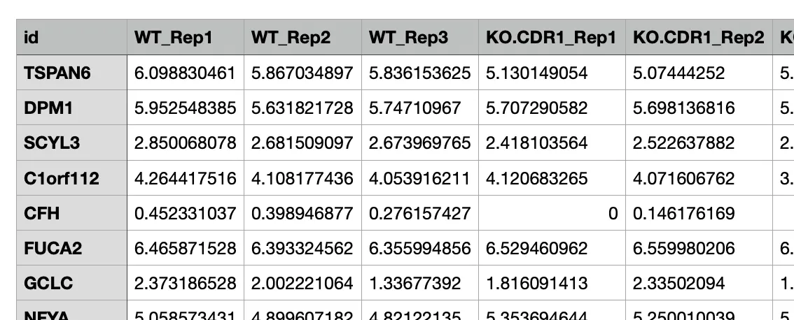
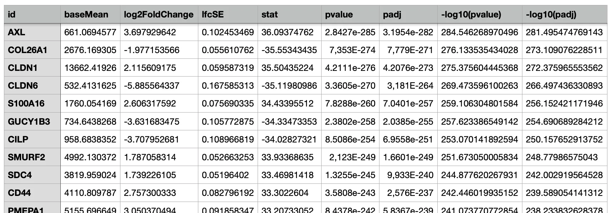

# **Database and Data Upload**

This section allows users to browse all datasets registered within the interface (i.e., custom database). Additionally, users can upload new datasets and modify information regarding existing datasets.

## <u> **Available data types** </u>

The interface accommodates four distinct types of data and specifies the required formatting for each.

1. **Count Data / Expression Matrix Data**: 
      The read count tables derived from RNA sequencing, proteomics, and various other sources, whether normalised or non-normalised, are considered. It is essential to note that while non-normalised data is permissible, the interface does not offer functionality for data normalisation. Ensure that the data adheres to the following criteria:
       - The table must be in  tab-delimited  format (either tsv or .txt file), featuring gene names in the index and sample names in the columns.
       - The header name (column name) containing gene names should be designated as "id" .
       - The sample names must conclude with *_Rep# or *_rep#.
    ??? Example
        

2. **Comparison Data**: 
      Any dataset containing log fold changes and statistical scores, including differentially expressed gene results from RNA sequencing and outcomes of CRISPR screening, among others, suitable for generating a volcano plot, may be input into OmicsBridge. It is imperative that the data complies with the following criteria:
       - The table must be formatted as tab-delimited (either tsv or .txt file) and must include headers, featuring gene names in the index.
       - The header name (column name) that encompasses gene names should be designated as "id".
    ??? Example
        

3. **scRNAseq data**: 
      Users can browse their single-cell RNAseq data, but it must be properly processed and saved as an RDS file. See the "scRNA" section for more details. 

4. **Epigenetic data (bam, bed, bigwig file, etc)**:
      Bam, bed, and bigwig files generated from ATACseq, ChIPseq, etc. can be browsed in the "Genome browser" section. 

## <u> How to upload a new dataset </u>

A new dataset can be uploaded in the ‘Data upload’ section. Please follow the guide below:

### 1. Upload the file. 
The file has to be **tab-delimited** **text** (tsv, txt) or **rds file** (for single cell RNAseq data, see the “scRNA” section) or **bam/bed/bigwig files** (for epigenetic data like ATACseq, ChIPseq.  See the “Genome browser” section), and the file size has to be less than 300MB. 

- Please make sure that  the header name (column name) containing gene/protein/transcription names is set to “id”. 
- When uploading a count table, use sample names as column headers (along with 'id'), with gene names as row indexes.  For replicated samples, we recommend adding "_Rep#" to the end of each sample name (e.g., "Sample_Rep1", "Sample_Rep2").  This naming convention allows you to integrate replicates when viewing swarm plots later. Please see the example below:

### 2. Fill in the dataset information. 
**Do not use line breaks in any text boxes,** as only the first line will be saved to the database.

- Dataset name: A unique identifier for your dataset. Ensure no other datasets share this name.
- Experiment name: The name of the experiment this dataset belongs to. Avoid using special symbols ( / ! ? etc).
- Data from: The source or creator of the dataset.
- Data type: The category of data, such as DEG from RNAseq or CRISPR screening. All datasets of the same Data type must share an identical data structure (same header/column names). This enables comparison across datasets (see "Compare across datasets" section).
- Data Class: Select the appropriate classification for your dataset.
- Cell line: (optional) The cell line used in the experiment.
- When: (optional) The date the data was collected.
- Description: (optional) Additional details about the dataset.

### 3. Click ‘Add to the dataset’, 
The user can see the newly added dataset at the top of the table.

## <u> How to edit the database </u>

### Editing the database
Each cell is editable by double-clicking. When the user makes an edit, the change will be displayed below the table. The editing is successful once the user clicks “Save changes” and confirms the message “saved!”. 

### Deleting some data
The user can select each row by just clicking them. They see how many rows are selected at the bottom of the table (multiple selections possible). By clicking “Delete selected data”, all the selected rows will be removed from the database.

