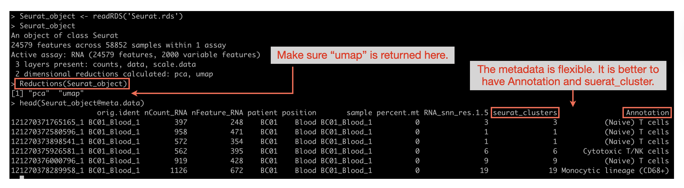

# scRNA dataset
Here, users can visualise the registered scRNAseq dataset and investigate their genes of interest in it. 


## <u> **0. Pre-processing** </u>
The interface accepts an RDS file as input for the scRNA section. The scRNA data must be processed using Seurat and ready for UMAP plotting (not tSNE). Before uploading to the interface, it is highly recommended to annotate each cluster with its corresponding cell type. For more information, please refer to the Seurat tutorial.

??? note "Seurat object preprocess"
    The Seurat object must be loaded from an RDS file. Ensure that `Reductions(Seurat_object)` returns "umap". While the metadata (Seurat_object@meta.data) is flexible, your data should ideally include "seurat_clusters" and "Annotation" fields for optimal functionality.
    

??? warning "Seurat object too large to upload? Reduce its size"
    If your RDS file is too large to upload, you can shrink it by removing data that is not required for data exploration in the **current version** of OmicsBridge (note: this may change in future versions, e.g. if new features come to rely on this data).

    ```r
    # Make the object smaller by removing unnecessary data

    # Scaled data (needed for PCA/DEG, but not required for data exploration in OmicsBridge)
    Seurat_obj@assays$RNA@layers$scale.data <- NULL

    # Count data (raw counts; not needed if already processed)
    Seurat_obj@assays$RNA@layers$counts <- NULL

    # Graph structures (used for clustering, but not needed for plotting)
    Seurat_obj@graphs <- list()

    # Command history (kept for reproducibility, safe to drop to save space)
    Seurat_obj@commands <- list()

    # Unnecessary reductions (keep only UMAP; e.g. remove PCA)
    Seurat_obj@reductions$pca <- NULL  # if only using UMAP
    ```

## <u> **1. Data overview** </u>

This section provides a simple UMAP overview of your data.

1. Select the dataset. The details will appear on the right.
2. By default, the plot is coloured according to the clusters defined by Seurat.
    - You can change the colouring option by selecting from a drop-down menu.
    - The available categories depend on the metadata in the dataset (stored in Seurat_object@meta.data).
3. To highlight a specific group, toggle on "Highlight a specific group".
    - A drop-down menu will appear for selecting a group.
    - You can customise the colours

??? success  "Adjustable graph parameters"
    - The size (width and height) of the figure.
    - The size of the XY axis/label, graph title and the legend font size.
    - The dot size

??? example  "Example Usage video"
    <video width="1000" controls>
    <source src="../videos/scRNA_1_annot_light.mp4" type="video/mp4"> 
    </video>


## <u> **2. Feature Plots** </u>

### <u> **2.1. Gene feature plot** </u>
1. Enter your genes of interest (one per line). They will appear as a selectable table below.
2. Click on a gene in the table to generate a feature plot. Cells not expressing the selected gene appear in black as background, while cells expressing the gene (UMI > 0) are highlighted with a gradient colour scheme (default: white to red).
 
??? success  "Adjustable graph parameters"
    - Figure size (width and height)
    - Font size for X/Y axes, labels, graph title, and legend
    - Dot size
    - Colours for highest/lowest expression and background
    - Option to use a white background

??? example  "Example Usage video"
    <video width="1000" controls>
    <source src="../videos/scRNA_2_annot_light.mp4" type="video/mp4"> 
    </video>

### <u> **2.2. Gene Signature feature plot** </u>
The interface can also calculate gene set signature scores (AUC scores) and generate a feature plot for visualisation.

AUC (Area Under the Curve) scores in scRNA-seq data measure the activity or enrichment of gene sets within single cells. They are calculated by ranking gene expression values in each cell and assessing how well a given gene set is enriched among highly expressed genes. AUC scores help infer pathway activity or transcription factor activity across cells, revealing functional differences between cell populations.

1. Enter your genes of interest (one per line) or choose from the custom gene sets.
2. Click the start button to calculate the AUC score for each single cell. This process takes a few minutes.
3. A feature plot will automatically appear on the right.
4. In the 'Violin plot' tab, you can view a violin plot comparing scores across user-specified groups. Select the desired group from the drop-down menu at the top.

??? success  "Adjustable graph parameters"
    - Figure size (width and height)
    - Font size for X/Y axes, labels, graph title, and legend
    - Dot size
    - Colours for highest/lowest expression and background
    - Option to use a white background

    For the violin plot:

    - Option to rotate the X-axis labels
    - Option to hide the jitter plots


??? example  "Example Usage video"
    <video width="1000" controls>
    <source src="../videos/scRNA_3_annot_light.mp4" type="video/mp4"> 
    </video>

## <u> **3. Other plots** </u>
### <u> **3.1. Dot plot** </u>

1. Enter gene names one per line or select a custom gene set.
2. Choose which subgroup you want to use. The dot plot will display gene expression across these selected subgroups.
3. Click the start button. The dot plot will appear on the right panel.

??? success  "Adjustable graph parameters"
    - The size (width and height) of the figure
    - The size of the X/Y axis labels, graph title, and legend font
    - The scale of each dot
    - The colour of the highest/lowest expression.

??? example  "Example Usage video"
    <video width="1000" controls>
    <source src="../videos/scRNA_4_annot_light.mp4" type="video/mp4"> 
    </video>

### <u> **3.2. Violin plot** </u>
1. Enter gene names one per line or select a custom gene set. A selectable table of genes will appear below.
2. Choose which subgroup you want to use. The violin plot displays gene expression across these selected subgroups.
3. Click a gene from the gene list table. The violin plot will appear on the right.
4. To view specific groups only, toggle the 'Select the groups to show' switch located below the plot.
    - A list of all group names will appear.
    - Only the selected groups will be displayed in the plot.

??? success  "Adjustable graph parameters"
    - The size (width and height) of the figure
    - The size of the X/Y axis labels, graph title, and legend font
    - Option to use a white background
    - Option to rotate X-axis labels

??? example  "Example Usage video"
    <video width="1000" controls>
    <source src="../videos/scRNA_5_annot_light.mp4" type="video/mp4"> 
    </video>

### <u> **3.3. Pie chart** </u>
Users can visualise the fraction of cells expressing specific genes across different clusters or cell types in the scRNA data. A cell is considered to be expressing a gene if it has a UMI count of 1 or greater.

1. Enter gene names one per line or select a custom gene set. A selectable table of genes will appear below.
2. Choose which subgroup you want to use for visualisation. The dot plot will display gene expression across these selected subgroups.
3. Click a gene from the gene list table. The pie chart will show the proportions of expressing and non-expressing cells across groups in the selected category, with labels indicating the cell count in each group.

??? success  "Adjustable graph parameters"
    - The size (width and height) of the figure
    - the size of the label, group names, and legend
    - The colour for the expressing and non-expressing segments in the pie chart
    - Option to hide the labels/legend

??? example  "Example Usage video"
    <video width="1000" controls>
    <source src="../videos/scRNA_6_annot_light.mp4" type="video/mp4"> 
    </video>